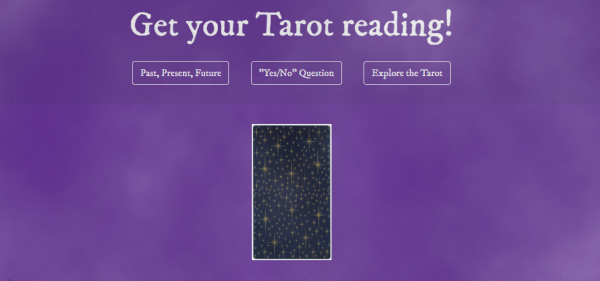
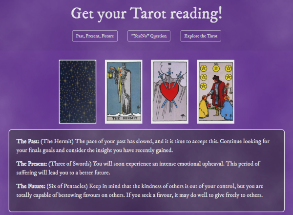
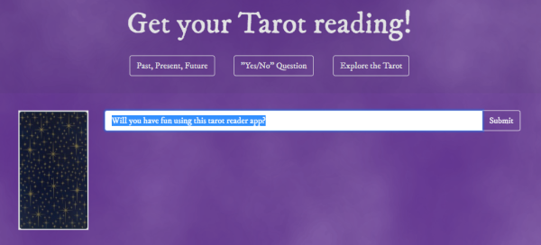
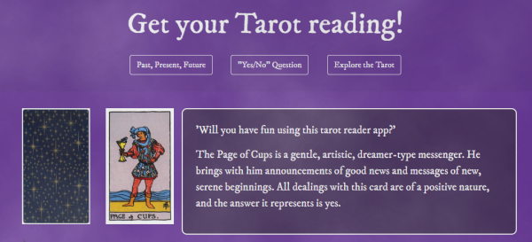
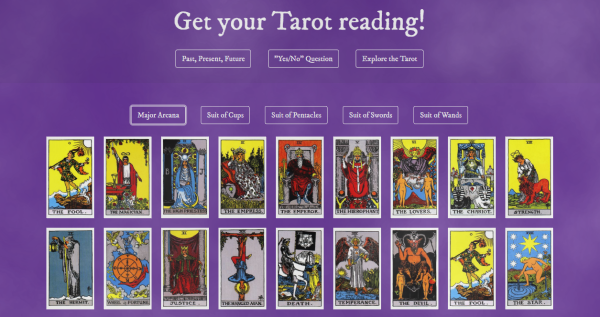
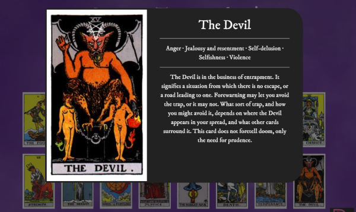

[![Contributors][contributors-shield]][contributors-url]
[![Forks][forks-shield]][forks-url]
[![Stargazers][stars-shield]][stars-url]
[![Issues][issues-shield]][issues-url]
[![MIT License][license-shield]][license-url]
[![LinkedIn][linkedin-shield]][linkedin-url]

# Tarot Reader

## Description 
The tarot fascinates me, so I built this app.  The app can do a three card tarot draw, a one card yes/no question tarot draw, or the user can explore the different cards

## Images
Starting View:

Past, Present, Future:

Yes/No Question:

Explore the Tarot:

## Installation 
If all files are kept in a single folder a web browser should be able to run the project.

## Usage 
The user has three options.
  1.  Past, Present, Future: The app randomly draws 3 cards and displays them for the user.  The first card is assigned to the past, the second to the present, and the third to the future.  The app then displays a guide on how the user can interpret the cards.

  2.  Yes/No Question:  The user is prompted to enter a yes or no question in the text field.  This is just to keep a record of what they meant to ask the tarot and keep them honest, it doesn't factor into the draw at all.  When the user enters their question and hits submit, a card is randomly drawn from the deck and displayed along with a guide to interpretation.

  3.  Explore the Tarot: The user can explore the different arcana and click on the cards to learn more about them.

## Credits 
Fisher-Yates shuffle function taken from https://frankmitchell.org/2015/01/fisher-yates/
All images and tarot meanings were taken from https://www.trustedtarot.com/card-meanings/
fog background from https://codepen.io/camstephensdomo/pen/PVqpaP

## Contributing 
Contributions are what make the open source community such an amazing place to be learn, inspire, and create. Any contributions you make are **greatly appreciated**.

1. Fork the Project
2. Create your Feature Branch (`git checkout -b feature/AmazingFeature`)
3. Commit your Changes (`git commit -m 'Add some AmazingFeature'`)
4. Push to the Branch (`git push origin feature/AmazingFeature`)
5. Open a Pull Request

## Live site: 
https://bryanbloomquist.github.io/tarot-reader/

[contributors-shield]: https://img.shields.io/github/contributors/bryanbloomquist/tarot-reader.svg?style=flat-square
[contributors-url]: https://github.com/bryanbloomquist/tarot-reader/graphs/contributors
[forks-shield]: https://img.shields.io/github/forks/bryanbloomquist/tarot-reader.svg?style=flat-square
[forks-url]: https://github.com/bryanbloomquist/tarot-reader/network/members
[stars-shield]: https://img.shields.io/github/stars/bryanbloomquist/tarot-reader.svg?style=flat-square
[stars-url]: https://github.com/bryanbloomquist/tarot-reader/stargazers
[issues-shield]: https://img.shields.io/github/issues/bryanbloomquist/tarot-reader.svg?style=flat-square
[issues-url]: https://github.com/bryanbloomquist/tarot-reader/issues
[license-shield]: https://img.shields.io/github/license/bryanbloomquist/tarot-reader.svg?style=flat-square
[license-url]: https://github.com/bryanbloomquist/tarot-reader/blob/master/LICENSE.txt
[linkedin-shield]: https://img.shields.io/badge/-LinkedIn-black.svg?style=flat-square&logo=linkedin&colorB=555
[linkedin-url]: https://www.linkedin.com/in/bryan-bloomquist-b1374416b/
[product-screenshot]: images/screenshot.png